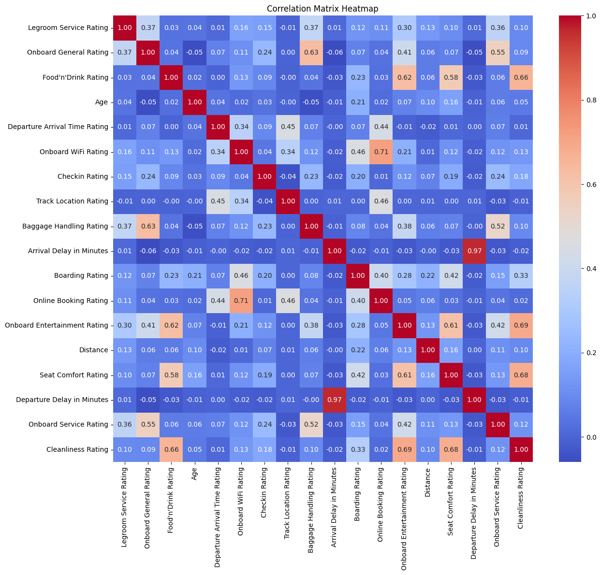
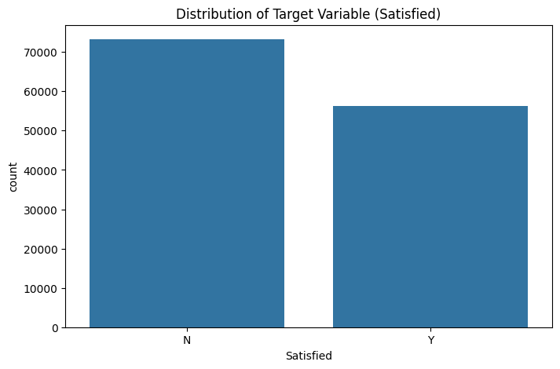
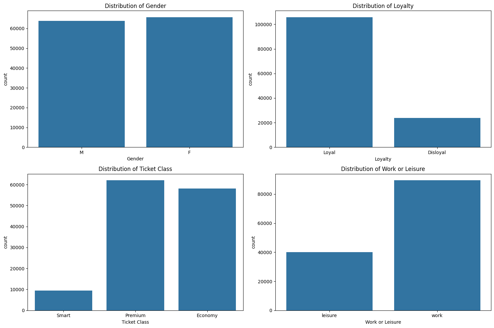
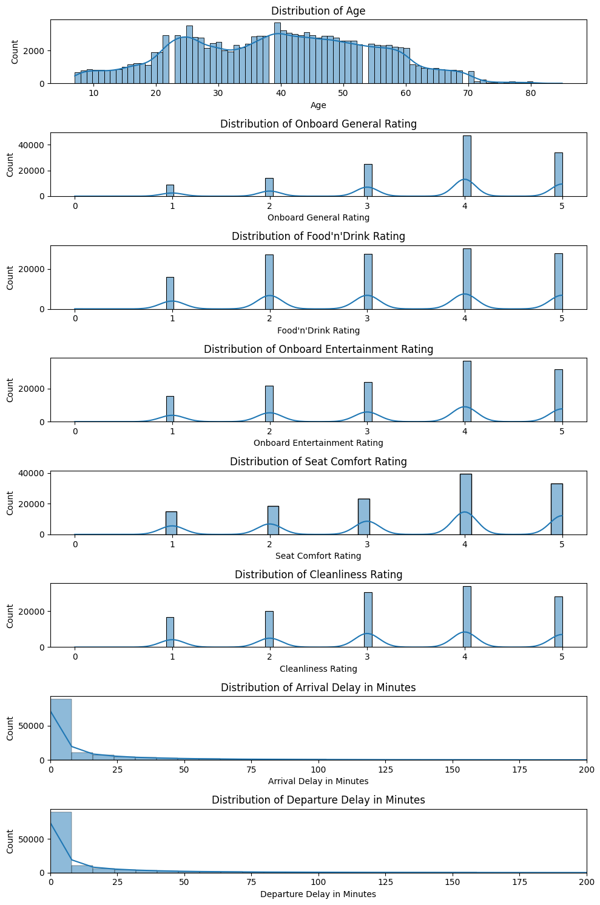
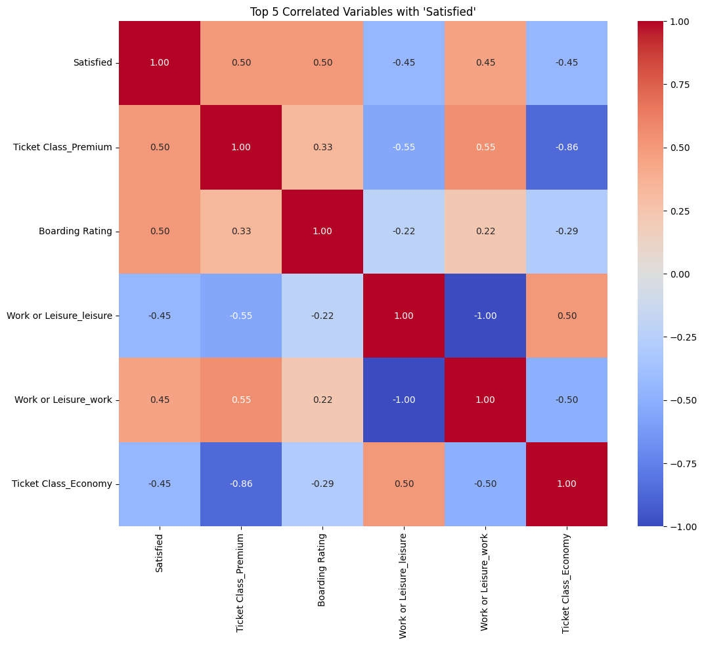
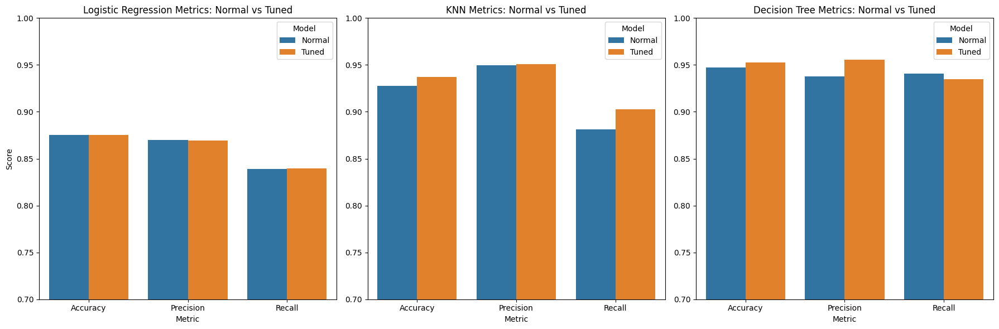
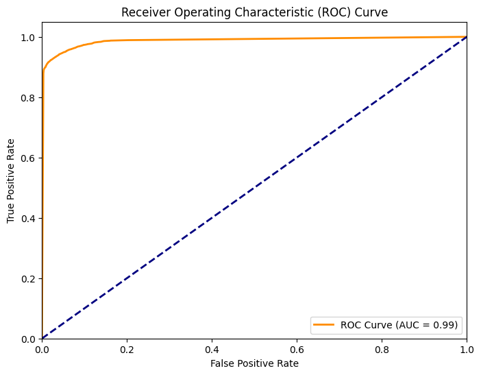

# Artificial Intelligence & Machine Learning - 2023/2024 : Trains Dataset Project 🚆
- **Bruni Sofia        (285231)**
- **Sebastiani Mattia  (288071)**
- **Torella Marta      (284091)**

## A Brief Introduction to our Project ⚙️ (section 1)
Welcome to our project and get ready to follow us in this journey as we explore the duties of a senior data scientist for the "famous" **ThomasTrain** company! As a matter of fact, our main goal is to help the company to improve its marketing campaign, and consequently to make the customer retention higher, by providing a model able to predict the satisfaction of a customer. To accomplish this task, we were provided with the the trains.cv, a dataset containing both categorical and numerical features about the customers and their satisfaction regarding different aspects of their experience; once we identified the binary categorical variable "Satisfied" (Y/N) as our target, we decided to approach the problem as a classification task. Here are the main steps we followed: 

- **Checking Data Integrity**: we started by checking the dataset for missing values, duplicates and outliers, and then we proceeded to deal with them;

- **Exploratory Data Analysis**: we performed a thorough analysis of the dataset, in order to understand the relationships between the features and the target, and to identify the most important features;

- **Preprocessing**: we encoded the categorical features, and then we standardized the numerical ones.
- **Splitting**: we split the dataset into training and test set;

- **Models Selection and Training**: we trained different models, and we evaluated them based on different metrics;

- **Hyperparameters Tuning**: we tuned the hyperparameters of our models, in order to improve their performance;

- **Final Evaluation**: we evaluated our models on the test set, and we drew our final conclusions. 

## Methods 🕵🏼‍♂️ (section 2)
### Environment
We used Python version 3.11.1, and the following libraries:
- Pandas
- Numpy
- Matplotlib
- Seaborn
- Scikit-learn
### Dataset Overview: trains.csv
In order to train and test our models we were provided with the trains.csv dataset, in which each row represents a different Ticket ID while the columns corresponds to different features according to clients' evaluation of their experience with the compay and their personal information. Among the 25 features composing our dataset, 19 ('Legroom Service Rating', 'Onboard General Rating', "Food'n'Drink Rating", 'Age', 'Departure Arrival Time Rating', 'Onboard WiFi Rating', 'Ticket ID', 'Checkin Rating', 'Track Location Rating', 'Baggage Handling Rating', 'Arrival Delay in Minutes', 'Boarding Rating', 'Online Booking Rating', 'Onboard Entertainment Rating', 'Distance', 'Seat Comfort Rating', 'Departure Delay in Minutes', 'Onboard Service Rating', 'Cleanliness Rating') are numerical, 14 of which are included in the range [0,5] since they represent ratings assigned to different services by costumers, while the remaining 6 ('Ticket Class', 'Loyalty', 'Gender', 'Satisfied', 'Date and Time', 'Work or Leisure') are categorical. The target variable is the binary categorical variable "Satisfied" (Y/N), which we are going to predict. 
### Preparation of Data and Dataset Exploration
We loaded the dataset into a pandas dataframe and proceeded to check for missing values; after we found out that the only feature containing missing values was "Arrival Delay in Minutes", we decided to drop the rows corresponding to those missing values, since there were only 393 missing values out of 129880 total values, and we considered them negligible. We also decided to drop two variables: "Ticket ID" and "Date and Time": as a matter of fact the 'Ticket ID' is a unique ID assigned to the travel ticket not providing any additional information about our customers, while the 'Date and Time' is a variable containing the date and time of the travel that again doesn't provide any information about the satisfaction rate (different from the Departure Arrival Time Rating which instead rates the punctuality of the services provided by the company).

After cleaning the data, we started conducting our EDA (Exploratory Data Analysis) by getting a first visive evaluation of the variables interactions by plotting the correlation matrix for the numerical features, in which we observed that the highest correlation (excluding the values along the diagonal and the correlation between 'Departure Delay in Minutes' and 'Arrival Delay in Minutes' which is quite straightforward) was achieved by 'Online Booking Rating' and 'Onboard Wifi Rating' which can be explained by the fact that both features are related to the online experience of the customer. Other relevant high correlation scores were achieved between 'Cleanliness Rating' and 'Onboard Entertainment Rating', between 'Seat Rating' and 'Cleanliness Rating', and lastly between 'Cleanliness Rating' and 'Onboard Entertainment Rating', which show how customers positively valued a clean environment and its comforts.

Then, we used some **'countplots'** to visualize the distribution of our target variable 'Satisfied' and of the remaining categorical features; the we formulated the following initial assumptions:

• **Satisfied**: for our target variable we can immediately see that the number of satisfied customers is lower than the number of unsatisfied customers, which could already be an indicator of a general trend in the data that might lead to a slightly unbalanced dataset;

• **Gender**: the presence of male and female customers was almost perfectly balanced in our dataset; 

• **Distribution of Loyalty**: customers that had already joined the company's loyalty program were more likely to use again the services provided by the company rather than customers that were not part of the loyalty program; this shows how the data collected for this analysis mainly came from regular customers who might have experienced the company' services more than once, making their ratings more reliable; 

• **Distribution of Ticket Class**: the purchase levels of Premium and Economy tickets registered almost the same values for both, while Smart Class tickets were only purchased by a small fraction of the total customers; therefore, the company might be facing two different types of customers: the ones that are willing to spend more for a better service (Premium Class) and the ones that are more price-sensitive and are willing to sacrifice some comfort for a cheaper ticket(Economy Class), without having an 'in-between' category of customers that are willing to spend a little more for a better service than the Economy Class but not as much as the Premium Class (Smart Class);

• **Distribution of Work or Leisure**: the majority of the customers were travelling for work rather than for leisure; this could be explained by the fact that the company mainly operates in the business sector, providing services for business travellers rather than for leisure travellers;
  

We finally explored the behaviour of our numerical features by plotting their histograms in order to get a better understanding of their distribution and to identify possible outliers; we observed that the majority of the features were normally distributed, with the exception of 'Distance', 'Departure Delay in Minutes' and 'Arrival Delay in Minutes' which were right-skewed, and 'Age' which was slightly left-skewed and right-skewed. Moreover, we deduced that: 

• **Ratings**: the ratings of the different services provided by the company were mainly positive, with the majority of the customers giving a rating of 4 out of 5; this could be an indicator of a good service provided by the company, but it could also be a sign of a biased dataset, since customers that were not satisfied with the service provided by the company might have decided to not give any rating at all;

• **Distribution of Age**: the age distribution of the customers was quite balanced between 20 and 60 years-old people with a slight skewness towards the younger and older customers; this could be explained by the fact that the company might mainly operate in the business sector (as showned by the majority of customers travveling for work purposes), providing services for business travellers rather than for leisure travellers, which are usually aged between 20 and 60 years old;

• **Distribution of Departure and Arrival Delay in minutes**: the distribution of the departure and arrival delay in minutes was quite similar since these two features are highly correlated, with the majority of the customers experiencing a delay of less than 10 minutes; this could be an indicator of a good service provided by the company, but it could also be a sign of a biased dataset, since again customers that experienced a delay of more than 10 minutes might have decided to not give any rating at all. 

### Data Preprocessing
In order to prepare our data for the training of our models, we first encoded the categorical features using the **'OneHotEncoder'** from the scikit-learn library; we proceeded in selecting the Pandas function *get_dummies* for the OneHotEncoding
In our case, we considered this method suitable for our nominal data because it doesn't introduce any artificial relationships between categories and, despite the 'curse of dimensionality', and in our case it didn't lead to a large number of features since we didn't obtain many unique categories.

After the encoding, we proceeded in analyzing the correlation between our target variable and all the other variables, even if we took notice only of the top 5 most correlated features (by taking into account the absolute value of the correlation coefficient). We noticed that he highest correlation with our target variable 'Satisfied' was achieved by 2 variables, the 'Ticket Class_Premium' variable (categorical) and the 'Boarding Rating' (numerical); however, also in this case we didn't achieve a correlation higher than 0.50. As previously discussed, the high correlation between 'Satisfied' and 'Boarding Rating' could be explained by the fact that the boarding experience is the first contact that the customer has with the company's services, and therefore it is crucial for the customer's satisfaction; moreover, the high correlation between 'Satisfied' and 'Ticket Class_Premium' could be explained by the fact that customers that are willing to spend more for a better service (Premium Class) are more likely to be satisfied by the service provided by the company. 

Furthermore, we can notice an inverse correlation of -0.45 between the target variable and the variables 'Work or Leisure_leisure' and 'Ticket Class_Economy': the first inverse correlation could be explained by the fact that customers travelling for leisure are more likely to buy Economy tickets (as shown by the correlation between 'Work or Leisure_leisure' and 'Ticket Class_Economy' of 0.50 against the correlation between 'Work or Leisure_leisure' and 'Ticket Class_Premium' of -0.55), and therefore they are more likely to be unsatisfied by the service provided by the company; the second inverse correlation could be explained by the fact that customers that are more price-sensitive and are willing to sacrifice some comfort for a cheaper ticket (Economy Class) are, as showed before, more likely to be unsatisfied by the service provided by the company.

### Splitting and Scaling the Data
Once the data was ready to be used for the training of our models, we proceeded in splitting it into training and test set, by using the **'train_test_split'** function from the scikit-learn library; we decided to have a split ratio of 75/25, meaning that 75% of the data is used for the train set and 15% of the data is used for the test set. We also decided to use a random state of 42, in order to have reproducible results. After the split, we proceeded in scaling the numerical features using the **'StandardScaler'** from the scikit-learn library; note that we fit the scaler only on the training data and not the testing data to avoid data leakage; after fitting the scaler on the training data, we transformed both the training and testing sets.

### Problem Definition and Model Selection
Due to the nature of our target variable 'Satisfied' (binary categorical variable), we decided to approach the problem as a classification task. Therefore, we decided to implement the following models according to our data specifi characteristicts: Logistic Regression, KNN and Decision Trees.

## Experimental Design 📐 (section 3)
After determining the nature of our task (classification) and the target variable (Satisfied), we distinguished two different phases in building our model:

- **Training of the models**: In this phase we focused on training our models in order to obtain a first evaluation of their performance; we trained three models, Logistic Regression, KNN and Decision Trees. We also evaluated the models' performances using different metrics, Accuracy, Precision, Recall, F1-Score, and by plotting the ROC curve and the confusion matrix. We used these first results as a baseline for the second phase.

- **Tuning the Hyperparameters**: In this phase we focused on tuning the hyperparameters of our models in order to improve their performance; we first used the **Randomized Search** algorithm, that is the *less computationally and timing expensive*, then we applied on the best parameters found the *Grid Search* algorithm in order to do a further research regarding the best parameters for the *best model possible*; again we evaluated the models' performances on the same metrics.

### Evaluation Metrics
- **Accuracy**: is defined as the *ratio of the number of correct predictions to the total number of predictions*. This metric is considered as a good starting point for classification problems that have well balanced data and not skewed; however, it is not a good metric when the dataset is imbalanced;

- **Precision**: is the ratio of true positives to the summation of true positives and false positives. It basically *analyses the positive predictions* and it's a particularly useful metric when the cost of false positives is high;

- **Recall**: is the ratio of true positives to the summation of true positives and false negatives. It basically *analyses the number of correct positive samples* and it's a particularly useful metric when the cost of false negatives is high;

- **F1 score**: is the *harmonic mean of precision and recall*. It is seen that during the precision-recall trade-off if we increase the precision, recall decreases and vice versa. The goal of the F1 score is to combine precision and recall;

- **Confusion matrix**: a table used to assess the performances of a classification model; it works by summarizing the counts of true positive, true negative, false positive, and false negative predictions.
- **Receiver Operating Characteristic(ROC) curve**: is a *probabilistic curve* used to *highlight the model’s performance*. The ROC curve is created by plotting the true positive rate (TPR) against the false positive rate (FPR) at various threshold settings. The area under the curve (AUC) is a measure of how well a parameter can distinguish between two groups. The higher the AUC, the better the model is at predicting.

### Models Selection
- **Logistic Regression:** we decided to use this model because it is a simple and fast model that can be used as a baseline for our analysis; moreover, it is a linear model that can be used for binary classification tasks, and it is also a probabilistic model that can be used to obtain the probability of a sample belonging to a certain class. Note that in order to apply this model to our dataset we had to start from the assumption that the features have a linearly decision boundary, which can be beneficial when the relationship between the features and the target variable is approximately linear; therefore, we decided to proceed with the training of this model since we wanted to explore the relationship between the features and the target variable assuming its linearity.

- **KNN:** after assuming linearity in the relationship between features and target variable, we decided to train a non-linear model, K-Nearest Neighbors (KNN), in order to explore the relationship between the features and the target variable assuming its non-linearity; this model is based on the main idea that the class of a data point is determined by the classes of its nearest neighbors. Hence, the main difference between this model and the previous one is that KNN is a so called *'lazy learner'*, meaning that it doesn't learn a discriminative function from the training data but it memorizes the training dataset instead, which might lead to obtaining a computationally expensive model.

- **Decision Trees:** the third and last model we selected is Decision Trees, which was mainly chosen after seeing the improvement achieved by the previous non-linear model KNN; indeed, Decision trees naturally handle non-linear relationships and interactions between features, and they can capture complex decision boundaries in the data without requiring explicit feature engineering. Moreover, they are also easy to interpret and visualize, which is a great advantage when we want to understand how the model makes predictions; in our case, we particularly valued this aspect since for the purpose of our project (that is to help the marketing team to target specific customers based on their satifaction) the marketing team might be interested in the role pleayed by each feature in determining the satifaction of a customer. 

### Hyperparameter Tuning
For this project, we devided this part into two steps:

- **Randomized Search:** we fistly used the RandomizedSearchCV algorithm which performs a random search over a specified hyperparameter distribution; instead of trying all possible combinations, it randomly samples a fixed number of hyperparameter configurations from the specified distribution and it uses *cross-validation* to evaluate the performance of each sampled configuration. This approach has two main benefits: it allows us to narrow down the range of hyperparameters to explore, and it allows us to control the computational budget we want to allocate to hyperparameter tuning.

- **Grid Search:** then we applied on the best parameters found, the Grid Search algorithm in order to do a further research regarding the best parameters; it takes as input a dictionary where keys are hyperparameter names, and values are lists of values to try (provided by the Randomized Search). It then evaluates all possible combinations of hyperparameter values using cross-validated performance. Even though this algorithm performs an exhaustive search over a specified hyperparameter grid, it can be more computationally expensive, especially with a large hyperparameter space, compared with Randomized Search (and that's why we decided to further proceed with Grid Search after selecting the best parameter to tune with Randomized Search).

## Results📊 (Section 4)
After training our models and tuning their hyperparameters, we evaluated their performance on the test set by using the same metrics used for the training phase; the *Decision Trees* model confirmed its performance as the best model at correctly classifying our target variable 'Satisfied', both in its untuned and tuned version, while the *Logistic Regression* model and its tuned version were the ones that achieved the lowest scores for every metric; this confirms our hypothesis that the relationship between the target variable and the input features is **not perfectly linear** as we previously assumed, and therefore the tuning of the hyperparameters might not be the best approach to improve its performance. 

Indeed, the *Decision Tree* model was the one that achieved the highest score for every metric, included AUC which scored 0.99 out of 1.This could be explained by the fact that the patterns in our dataset might involve complex decision boundaries; a decision tree might be more adept at capturing and representing these patterns compared to the local averaging approach of KNN and the linearity assumption of *Logistic Regression*. Also, KNN can be sensitive to outliers, as it relies on the majority class of the k-nearest neighbors while decision trees are more robust to them because they make decisions based on the majority class within regions of the feature space.

Finally, in the below figure we can observe the comparison between the performance of the three models we trained (Logistic Regression, KNN and Decision Trees) and their tuned versions in terms of accuracy, precision and recall on the test set; notice that each model is paired with its tuned version. Overall we can immediately observe that, in general, the tuned models were able to improve the results obtained on every metrics by the original models. Notice that the tuning of the *Logistic Regression* was the one that achived the lowest improvement, almost equal to zero, while the *Decision Tree* was the model that achieved the highest improvement.

## Conclusions🎖 (Section 5)
In conclusion, our exploration into enhancing the marketing campaign and customer retention for ThomasTrain through predictive modeling has yielded valuable insights, but mainly some priceless academic opportunity. The comprehensive evaluation of three models (Logistic Regression, KNN, and Decision Trees) allowed to apply and deepen our practical knowledge; moreover, by starting from scratch the whole project, we had the unique opportunity to gain a holistic understanding of the end-to-end data science process. This hands-on experience not only sharpened our technical skills but also provided invaluable lessons in project management, problem-solving, and collaboration within a team setting.

Contrary to our initial assumption of linearity, the Logistic Regression model, even after hyperparameter tuning, demonstrated suboptimal performance. The KNN model, while exhibiting competence, was outperformed by the Decision Trees model, which showcased remarkable improvements after tuning and achieved the highest scores across all metrics, including an impressive AUC of 0.99. The effectiveness of Decision Trees in capturing complex decision boundaries, as opposed to the assumptions of linearity and local averaging made by other models, became evident. Sensitivity to outliers, a potential issue for KNN, was mitigated by the robust nature of Decision Trees. The tuned models consistently outperformed their original counterparts, emphasizing the importance of hyperparameter tuning. Our findings offer a clear recommendation for leveraging Decision Trees for this predictive task, presenting a powerful tool for the marketing team to target specific customers based on satisfaction.

Indeed, our project showed the importance of data analysis in the *marketing field* and how it can be used to improve the marketing campaign and customer retention for ThomasTrain. As a matter of fact, By tuning and evaluating our models we were able get a fisrt understanding of the most important features in predicting the satisfaction of a customer, and of their relationship with the target variable. 

While our current work has provided valuable results, there remain areas for future exploration. Further investigation into ensemble methods, such as Random Forests, could offer enhanced predictive capabilities, even though we would like to raise some doubts about that; as a metter of fact, the tuning of *Logistic Regression* already showed nearly perfect results, and introducing even more intricate models might introduce unnecessary complexity. Lastly, considering temporal aspects and incorporating time-series analysis could provide a more dynamic understanding of customer satisfaction trends that might vary over time.